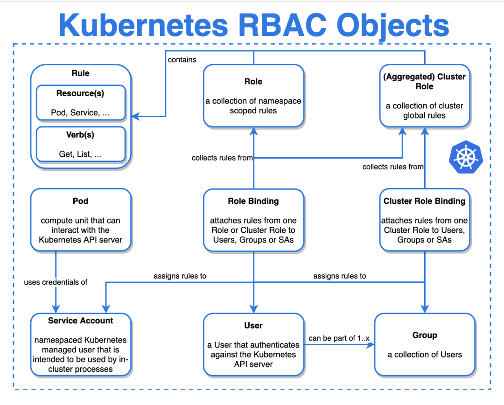

<H1>Kubernetes RBAC Objects</H1>

 

**Role-based access control (RBAC)** — это метод регулирования доступа к компьютерным или сетевым ресурсам на основе ролей отдельных пользователей или групп.  
В рамках модели контроля доступа на основании ролей есть 6 сущностей: ***Role, RoleBinding, ClusterRole, ClusterRoleBinding, ServceAccount, Rules.***
 
>**Note**
>
> **Users** — (Пользователи кластера Kubernetes) все, кто шлёт запросы в API-сервер, не только администраторы и разработчики, но и различные скрипты CI/CD, компоненты control plane, kubelet и kube-proxy на узлах, а также приложения, запущенные в кластере. 
> 
> **Group** — Группа пользователей

## 1. ServiceAccount
**ServiceAccount** -  (учетная запись службы) — это учетная запись, которая позволяет компоненту приложения напрямую обращаться к API (по средствам токена)без предоставления учетных данных (логина и пароля) пользователя.

## 2. Rules
**Rules** — это список правил, описывающих права доступа.  

Параметры:

- **apiGroups** — описывает API-группу манифеста. Это то, что написано в поле apiVersion: до слеша. Если в apiVersion указана только версия, без группы, например, как в манифесте Pod, то считается, что у этого манифеста так называемая корневая группа (core-group); в роли корневая группа указывается как пустая строка “”.
- **verbs** — список действий, которые можно сделать с ресурсами, описанными выше: получить, посмотреть список, следить за изменением, отредактировать, удалить и т.п.
- **resourсes** — список ресурсов, к которым мы описываем доступ, во множественном числе (pods, services).

## 3. Role
**Role** — это YAML-манифест,  который описывает некий набор прав на объекты кластера Kubernetes.  
Role ничего и никому не разрешает. Это просто список. Описывает права в неймспейсе.  

>**Warning**
>
>Eсли вы запретили девелоперу выполнять kubectl exec, но у него есть доступ на воркер-ноду, то зайти на воркер-ноду и сделать docker exec в контейнер RBAC запретить никак не сможет.

## 4. RoleBinding
**RoleBinding** — назначает в роли, пользователю или группе пользователей.  
 - Cодержит список субъектов (пользователей, групп или учетных записей служб) и ссылку на предоставленную роль.
 - Даёт доступ только к тем сущностям, которые находятся в том же неймспейсе, что и манифест RoleBinding.

RoleBinding может ссылаться на любую роль в том же пространстве имен. Кроме того, RoleBinding может ссылаться на ClusterRole и привязывать эту ClusterRole к пространству имен RoleBinding.

## 5. Cluster Role
**Cluster Role** — это кластерный объект, эта сущность описывает права на объекты во всём кластере.

## 6. ClusterRoleBinding
**ClusterRoleBinding** — назначает в роли, пользователю или группе пользователей. 
 - Cодержит список субъектов (пользователей, групп или учетных записей служб) и ссылку на предоставленную роль.
 - Позволяет выдать доступ к сущностям во всех неймспесах кластера сразу.

---

