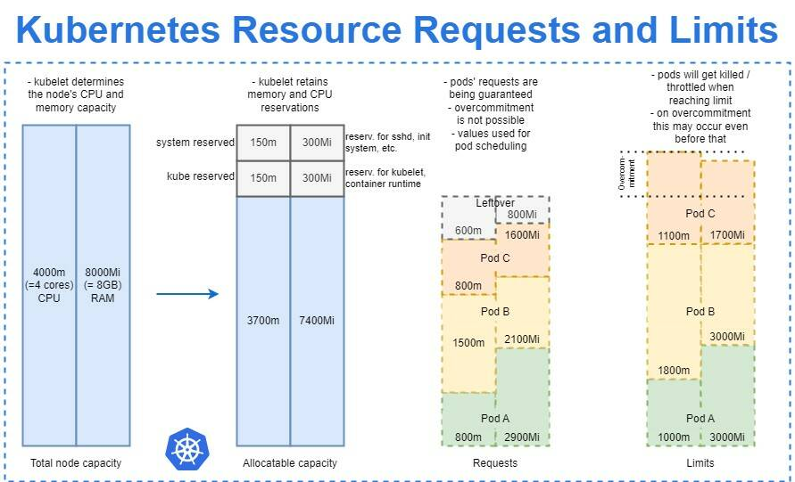

<H1>Kubernetes Resource Requests&Limits</H1>

 

Для каждого ресурса Kubernetes имеется возможность настраивать два типа требований — Requests и Limits. Первое описывает минимальные требования к наличию свободных ресурсов узла, необходимых для запуска контейнера или пода, второе жестко ограничивает ресурсы, доступные контейнеру.

- **Requests** — это то, в результате чего контейнер гарантированно получает запрашиваемый ресурс. Если контейнер запрашивает ресурс, то Kubernetes запланирует его только на том узле, который способен его предоставить.
- **Limits** — контролируют, что ресурсы, запрашиваемые контейнером, никогда не превысят определенного значения.

Если на узле, где работает под, имеется достаточно доступных ресурсов, контейнер может использовать больше ресурсов, чем указано в Request, но не больше чем указано в Limits. 

**Принцип работы контроля ресурсов**  
 
1. Kubelet определяет объем процессора и памяти Nod

2. Резервирует объема памяти для системы и для kubelet

3. Подам назначаются ограничения по использованию памяти.

4. При приближению к лимиту:  
   - Контейнер может быть убит.
   - Начнется Throttling CPU контейнера.
   - Процесс в контейнере может быть завершен с ошибкой нехваткой памяти (ООМ).

Ограничения могут быть реализованы либо реактивно (система вмешивается, как только видит нарушение), либо проактивно (система предотвращает превышение лимита контейнером). Различные среды выполнения могут иметь разные способы реализации одних и тех же ограничений.

> ### Основные типы ресурсов:  
> CPU (Милликоры) 1 ядро = 1000m, 0,5 ядра = 500m  
> RAM (Mi) 200Mb = 200Mi

---

